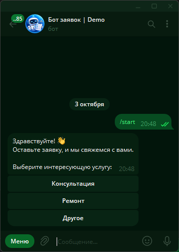
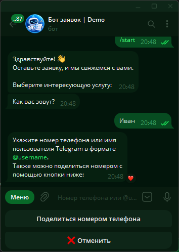
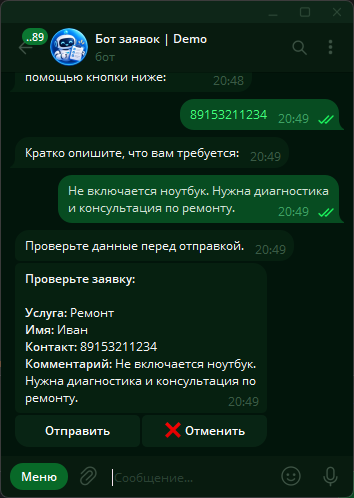
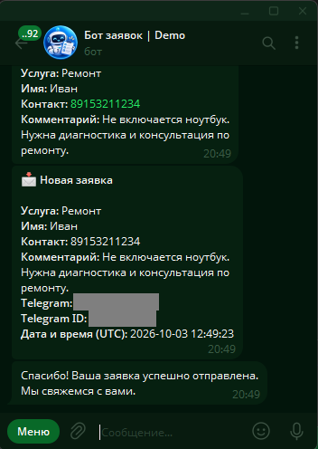
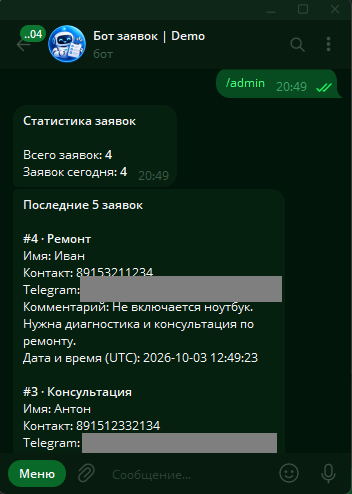

# Telegram Lead Bot

Простой Telegram-бот для сбора заявок от клиентов малого бизнеса. Пользователь
выбирает услугу, оставляет имя и контакт, описывает задачу и подтверждает
отправку. Бот сохраняет заявку в SQLite и отправляет полную информацию
администратору.

## Демонстрация

### Создание заявки

<p align="center">
  
  
  
</p>

### Уведомление администратора и статистика

<p align="center">
  
  
</p>

## Возможности

- выбор услуги: «Консультация», «Ремонт» или «Другое»;
- пошаговая форма заявки на FSM из aiogram;
- ввод телефона, имени пользователя Telegram или отправка Telegram-контакта;
- проверка данных перед отправкой;
- отмена заявки кнопкой на любом шаге или командой `/cancel`;
- автоматическое создание базы данных SQLite;
- уведомление администратора о каждой новой заявке;
- команда `/admin` со статистикой и пятью последними заявками;
- команда `/leads` с десятью последними заявками;
- отдельное меню команд администратора.

## Требования

- Python 3.11 или новее;
- токен Telegram-бота;
- числовой Telegram ID администратора.

## Создание бота через BotFather

1. Откройте в Telegram [@BotFather](https://t.me/BotFather).
2. Отправьте команду `/newbot`.
3. Укажите отображаемое имя и уникальное имя пользователя, заканчивающееся на
   `bot`.
4. Скопируйте полученный токен. Не публикуйте и не передавайте его посторонним.

Меню команд настраивается ботом автоматически при запуске. Обычные пользователи
видят `/start`, а администратор дополнительно видит `/admin` и `/leads`.

## Как получить ADMIN_ID

`ADMIN_ID` — это числовой Telegram ID, а не имя пользователя. Его можно узнать,
например, отправив сообщение боту [@userinfobot](https://t.me/userinfobot).

До проверки уведомлений откройте созданного бота с аккаунта администратора и
нажмите **Запустить** (Start). Telegram не позволяет боту первым начать диалог с
пользователем.

## Установка

Откройте терминал в папке проекта, создайте виртуальное окружение и установите
зависимости.

Windows PowerShell:

```powershell
py -3.11 -m venv .venv
.venv\Scripts\Activate.ps1
pip install -r requirements.txt
```

macOS или Linux:

```bash
python3.11 -m venv .venv
source .venv/bin/activate
pip install -r requirements.txt
```

Скопируйте `.env.example` в `.env` и заполните обе переменные:

```dotenv
BOT_TOKEN=123456789:replace_with_your_bot_token
ADMIN_ID=123456789
```

Файл `.env` содержит секретный токен и уже добавлен в `.gitignore`.

## Запуск

Активируйте виртуальное окружение и выполните:

```bash
python bot.py
```

Бот работает через long polling, поэтому терминал должен оставаться открытым.
При первом запуске в папке проекта автоматически создаётся файл `leads.db`.

## Проверка работы

1. Откройте бота и отправьте `/start`.
2. Выберите услугу и заполните имя, контакт и комментарий.
3. Проверьте данные и нажмите **Отправить**.
4. Убедитесь, что пользователь получил сообщение об успешной отправке, а
   администратор — полную заявку.
5. С аккаунта администратора проверьте команды `/admin` и `/leads`.
6. Проверьте отмену кнопкой **❌ Отменить** на шагах имени, контакта и
   комментария, а также кнопкой **❌ Отменить** на экране подтверждения.
7. Проверьте резервную команду `/cancel` во время заполнения формы.
8. Отправьте `/admin` с другого аккаунта и убедитесь, что доступ закрыт.

## Структура проекта

```text
telegram-lead-bot/
├── bot.py                 # Запуск, polling и меню команд
├── config.py              # Загрузка и проверка настроек окружения
├── database.py            # Инициализация SQLite и запросы к базе
├── handlers/
│   ├── admin.py           # Команды администратора
│   └── user.py            # Пользовательский сценарий и состояния FSM
├── keyboards/
│   ├── inline.py          # Кнопки услуг и подтверждения
│   └── reply.py           # Кнопки контакта и отмены
├── .env.example           # Шаблон переменных окружения
├── .gitignore
├── requirements.txt
└── README.md
```

Время создания заявки хранится в UTC. Счётчик заявок за сегодня использует
локальный часовой пояс компьютера, на котором запущен бот.
